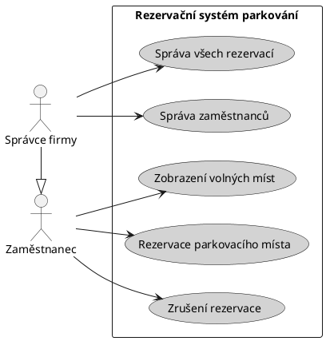
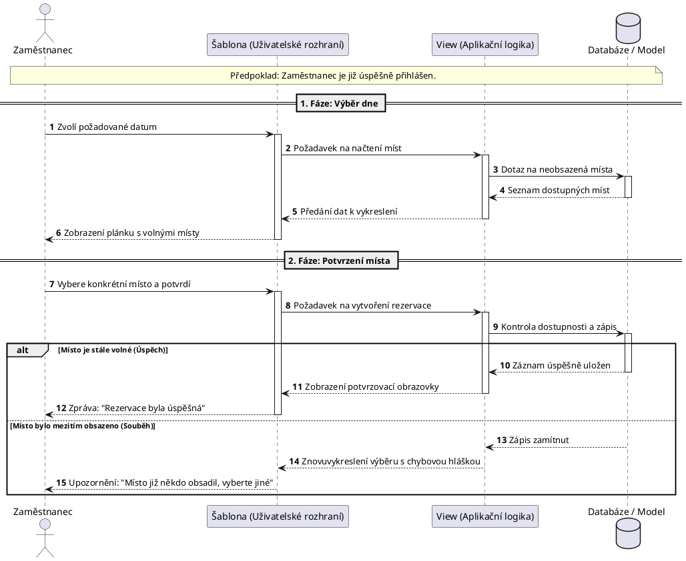
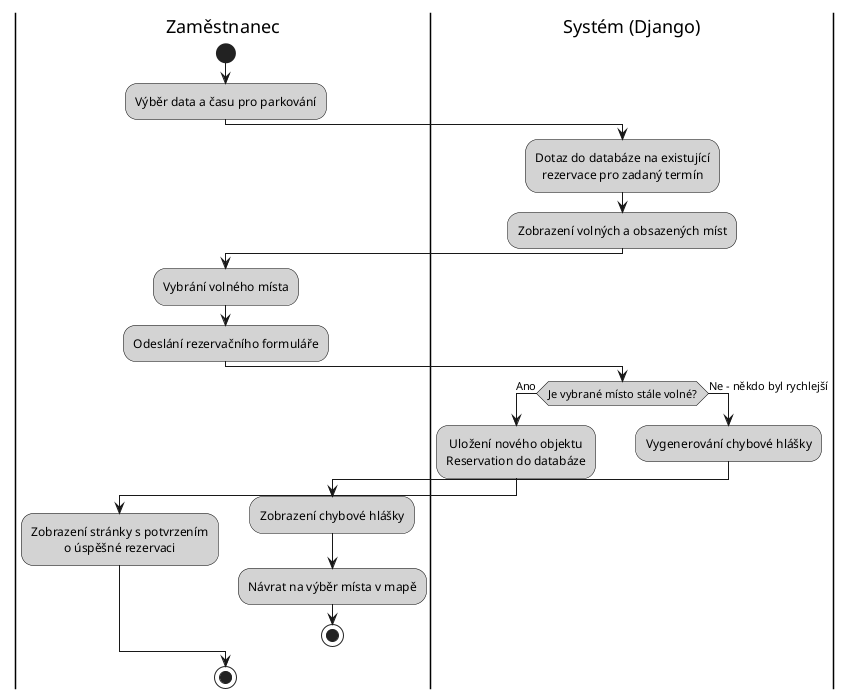
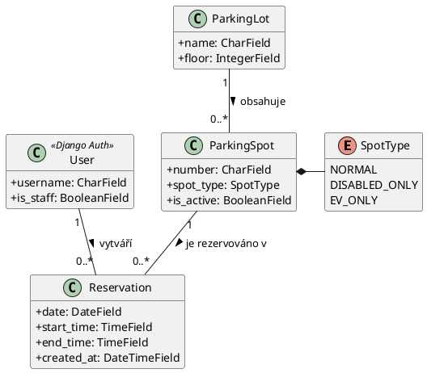

# Architektura rezervačního systému

Tento dokument popisuje návrh a architekturu systému pro rezervaci parkovacích míst.

---

## 1. Use Case Diagram
Zachycuje hlavní případy užití z pohledu zaměstnance a správce firmy.

---

## 2. Sekvenční diagram
Popisuje interakci uživatele, aplikační logiky (Django views) a databáze během procesu vytváření rezervace, včetně ošetření chybového stavu.

---

## 3. Activity Diagram
Rozděluje rezervační proces na kroky prováděné uživatelem na frontendu a operace zpracovávané na pozadí v Djangu.

---

## 4. Class Diagram
Reprezentuje strukturu databázových modelů, jejich atributy a vzájemné relace.

